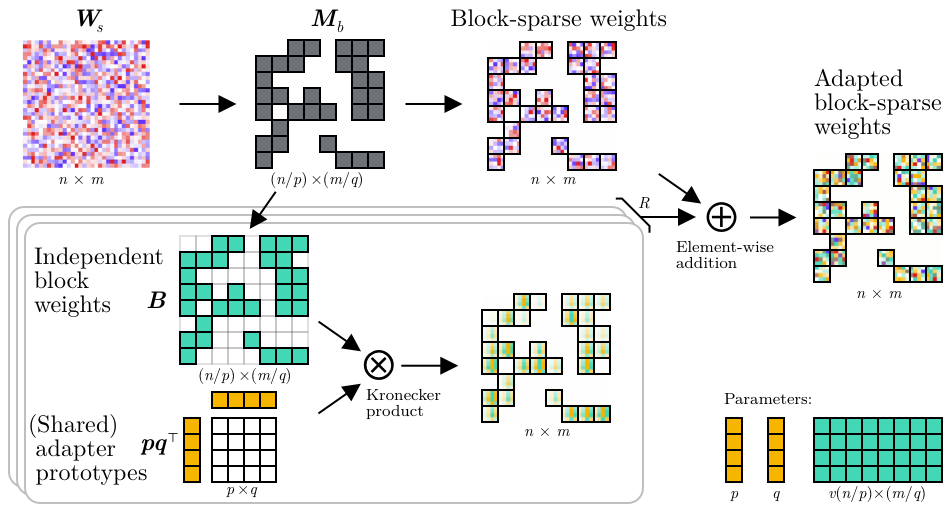

# Block-based Structured Adapter Pruning Experiments

This repository contains experiments for the block-based SPA, __Structured Pruning Low-rank Adapter (SPLoRA)__, proposed in `link-to-paper-comping-up`  using various structured pruning methods, for weight-based transfer learning of BERT on the SQuAD question-answering dataset.


<div align="center">

</div>

## Installation ⚙️
- Clone this repository and enter it: 
    ```bash
    git clone https://github.com/LukasHedegaard/block-spa-experiments.git
    cd block-spa-experiments
    ```
- (Optionally) create conda environment:
    ```bash
    conda create --name block-spa-experiments python=3.10
    ```
- Install as editable module
    ```bash
    pip install -e .[dev]
    ```

## Run training + pruning 🏃‍♂️

The experiments are distributed over two branches:
- `splopa` / `master`: Run the Structured Pruning Low-rank PHM Adapter (SPLoPA).
- `fine-pruning`: Run fine-pruning baselines as found in the [block-movement-pruning repository](https://github.com/huggingface/block_movement_pruning).

Select the branch of choice prior to running the experiment.

For reproducibility purposes, we use a detailed excel sheet ([hparams/hyperparameters.xslx](hparams/hyperparameters.xslx)) to specify hyper-parameters.

To select and spawn a run, please follow these steps:
1. Open [hparams/hyperparameters.xslx](hparams/hyperparameters.xslx).
2. Note the "EXP ID" (col C) and "Effective encoder remain weights %" (col D) for the chosen row (this constitutes one run).
3. Modify [scripts/run_squad_from_excel_sheet.py](scripts/run_squad_from_excel_sheet.py) accordingly. Note that if multiple runs are specified, they will be spawned in each their own process.
4. Run `python scripts/run_squad_from_excel_sheet.py`.

